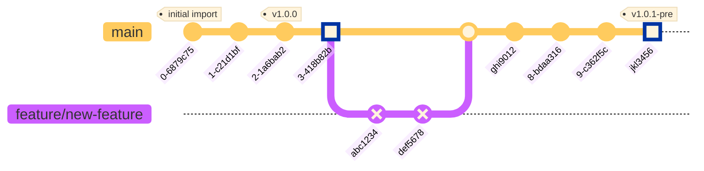

# Deployment Overview
Deployments are managed by [AWS Copilot](https://aws.github.io/copilot-cli/) from this repo's [GitHub Actions](https://github.com/wri/ocean-watch/actions)

## Introduction

In this project, we employ several industry best practices for Continuous Integration and Continuous Deployment (CI/CD) to ensure the reliability, scalability, and maintainability of our codebase. Central to our approach are mainline development and the use of immutable Docker containers.

## Mainline Development

Mainline development, also known as trunk-based development, is a version control strategy where developers integrate their changes into the main branch frequently, typically on a daily basis. This practice minimizes the complexity and risks associated with long-lived feature branches and ensures that the main branch is always in a deployable state. By continuously merging small, incremental changes, we reduce integration challenges and foster a culture of continuous collaboration and code review. This approach not only accelerates the delivery of new features but also enhances code quality through frequent integration and testing.

## Immutable Docker Containers

In our CI/CD pipeline, we leverage immutable Docker containers to build and deploy our applications. Immutable containers ensure that once an image is built, it remains unchanged throughout its lifecycle. This practice guarantees consistency across different environments (development, staging, and production) by eliminating discrepancies caused by configuration drift or manual interventions. By tagging Docker images with unique identifiers, such as commit SHAs or pre-release versions, we can reliably trace and reproduce any version of our application. This approach enhances the reliability of our deployments, simplifies rollbacks, and improves overall system stability.

## C4 Deployment Diagram for Ocean Watch Platform

### Production

*Coming Soon!*

---

### Staging

#### GitHub Actions Pre-Release Workflow

This document outlines the theory of operation for the GitHub Actions workflow designed to handle pre-release events, build and tag Docker images with pre-release versions, and deploy applications to a staging environment using AWS Copilot. This workflow ensures that pre-releases are properly tested and deployed in a controlled staging environment before going live.

#### Theory of Operation

When a pre-release is created, the GitHub Actions workflow is triggered. The workflow performs several steps to tag the Docker image with the pre-release version, push the image to the GitHub Container Registry (GHCR), and deploy the application to the staging environment using AWS Copilot. This process ensures that the pre-release version is thoroughly tested in a staging environment before being promoted to production.

#### Git Branching and Tagging Example

The following gitGraph diagram illustrates the process of tagging Docker images with pre-release versions and deploying them to the staging environment.

#### Comments for Developers

1. **Initial Release**
    - **Commit A**: `v1.0.0`
        - The initial release of the application is tagged as `v1.0.0`.

2. **Feature Branch**
    - **Commit abc1234**:
        - The first commit on the `feature/new-feature` branch.
        - This commit introduces new changes to the feature branch.
    - **Commit def5678**:
        - Another development commit on the `feature/new-feature` branch.
        - Changes in this commit will be included in the Docker image built for this feature branch.

3. **Merge Feature to Main**
    - **Commit ghi9012**
        - After the `feature/new-feature` branch is reviewed and approved, it is merged into the `main` branch.
        - The last Docker image that was built from the branch's HEAD is pulled and the merge SHA label is added.
            - Example tag: `ghcr.io/ocean-watch/nextjs-app:main-ghi9012`
            - Example command: `copilot svc deploy --name nextjs-app --env main`
        - The PR review environment is destroyed using AWS Copilot
4. **Pre-Release Tagging**: `jkl3456`
    - When a pre-release is created, the Docker image built from the corresponding commit is re-tagged with the pre-release version (e.g., `v1.0.1-pre`).
    - This ensures that the pre-release version is distinctly identified and can be tested separately.
5. **Staging Deployment**:
    - The tagged pre-release Docker image is deployed to the staging environment using AWS Copilot.
    - This allows thorough testing of the pre-release version in a controlled environment before it is promoted to production.

#### Sequence Diagram of the Workflow

The following sequence diagram provides an abstract overview of the steps involved in the workflow from pre-release creation to deployment in the staging environment.

This sequence diagram outlines the main actions taken during the workflow, from the creation of a pre-release to the final deployment on AWS staging, providing a clear and concise overview of the process.

### AWS Copilot Staging Environment C4 Deployment Diagram

---

### Pull Request (PR) Review
The review environments were inspired by [Heroku's Review Apps](https://devcenter.heroku.com/articles/github-integration-review-apps) environments and an [AWS Copilot tutorial](https://aws.amazon.com/blogs/containers/build-preview-environments-for-amazon-ecs-applications-with-aws-copilot/).

#### GitHub Actions Deployment Workflow

This document outlines the theory of operation for the GitHub Actions workflow designed to handle pull requests, build and push Docker images to GitHub Container Registry (GHCR), and deploy applications using AWS Copilot. The process ensures efficient CI/CD (Continuous Integration and Continuous Deployment) with automated testing, building, and deployment steps.

#### Theory of Operation

When a pull request (PR) is created to the main branch, the GitHub Actions workflow is triggered. The workflow performs a series of steps to checkout the code, set up the environment, run linting and tests, build and tag Docker images, push these images to GHCR, and finally deploy the application using AWS Copilot. This automated process ensures that each change is thoroughly tested and deployed in a consistent manner.

#### Git Branching and Tagging Example

The following gitGraph diagram illustrates a typical git branching and tagging workflow, demonstrating the process of creating new AWS Copilot environments and updating existing ones based on commits.

#### Comments for Developers

1. **Initial Release**:
    - **Commit A**: `v1.0.0`
        - The initial release of the application is tagged as `v1.0.0`.

2. **Feature Branch**:
    - **Commit abc1234**:
        - The first commit on the `feature/new-feature` branch.
        - This commit will trigger the creation of a new AWS Copilot environment if it does not already exist.
        - Example command: `copilot env init --name new-feature --app ocean-watch`
    - **Commit def5678**:
        - Another development commit on the `feature/new-feature` branch.
        - Changes in this commit will be included in the Docker image built for this feature branch.
        - Example tag: `ghcr.io/ocean-watch/nextjs-app:feature-new-feature-def5678`

3. **Merge Feature to Main**:
    - **Commit ghi9012**: `v1.1.0`
        - After the `feature/new-feature` branch is reviewed and approved, it is merged into the `main` branch.
        - The last Docker image that was built from the branch's HEAD is pulled and the merge SHA label is added.
          - Example tag: `ghcr.io/ocean-watch/nextjs-app:main-ghi9012`
          - Example command: `copilot svc deploy --name nextjs-app --env main`
        - The PR review environment is destroyed using AWS Copilot

#### Additional Notes

- **Creating New Environments**:
    - The first commit on a new feature branch (e.g., `abc1234`) will create a new AWS Copilot environment if it does not exist.
    - This ensures that each feature branch can be tested in isolation with its own environment.

- **Updating Existing Environments**:
    - Subsequent commits (e.g., `def5678`) will build new Docker images and deploy them to the existing environment created by the first commit.
    - This process allows continuous integration and deployment for every change made to the feature branch and main branch.

#### Sequence Diagram of the Workflow

The following sequence diagram provides an abstract overview of the steps involved in the workflow from Docker build to GHCR during a pull request.

This sequence diagram outlines the main actions taken during the workflow, from the initial pull request creation to the final deployment on AWS, providing a clear and concise overview of the process.

### AWS Copilot Environment C4 Deployment Diagram

---