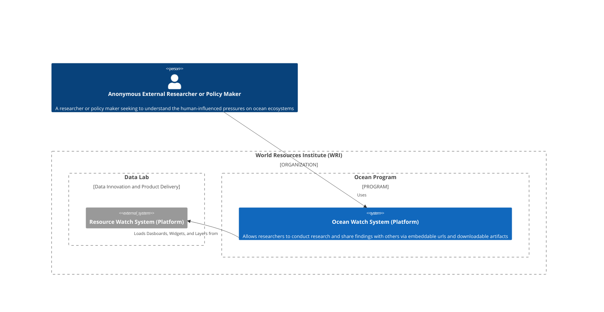
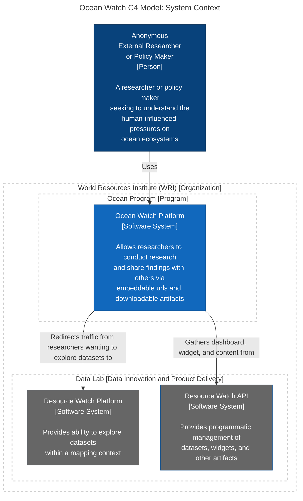

# Architectural Overview

## C4 System Context Diagram for Ocean Watch

```mermaid
C4Context
    Person(researcherPublic, "Anonymous External Researcher or Policy Maker", "A researcher or policy maker seeking to understand the human-influenced pressures on ocean ecosystems")

    Boundary(BoundaryWRI, "World Resources Institute (WRI)", "ORGANIZATION") {
        Boundary(BoundaryDataLab, "Data Lab", "Data Innovation and Product Delivery"){
            System_Ext(ExtSystemResourceWatch, "Resource Watch System (Platform)")
        }
        Boundary(BoundaryOceanProgram, "Ocean Program", "PROGRAM", $link="https://www.wri.org/ocean") {
            System(SystemOceanWatch, "Ocean Watch System (Platform)", "Allows researchers to conduct research and share findings with others via embeddable urls and downloadable artifacts", $link="https://oceanwatchdata.org")
           
        }
        
        
    }

    Rel(researcherPublic, SystemOceanWatch, "Uses")
    UpdateRelStyle(researcherPublic, SystemOceanWatch, $offsetX="180", $offsetY="100")
    
    Rel(SystemOceanWatch, ExtSystemResourceWatch, "Loads Dasboards, Widgets, and Layers from")
    UpdateRelStyle(SystemOceanWatch, ExtSystemResourceWatch, $offsetX="-230", $offsetY="10")
    
    UpdateLayoutConfig($c4ShapeInRow="3", $c4BoundaryInRow="2")
```

```mermaid
---
title: "Ocean Watch C4 Model: System Context"
---
flowchart TD
  PersonResearcher["Anonymous\nExternal Researcher\nor Policy Maker\n[Person]\n\nA researcher or policy maker\nseeking to understand the\nhuman-influenced pressures on\nocean ecosystems"]
  
  subgraph BoundaryWRI["World Resources Institute (WRI) [Organization]"]
    subgraph BoundaryOceanProgram["Ocean Program [Program]"]
      SystemOceanWatch["Ocean Watch Platform\n[Software System]\n\nAllows researchers to conduct research\nand share findings with others via\nembeddable urls and downloadable artifacts"]
    end
    subgraph BoundaryDataLab["Data Lab [Data Innovation and Product Delivery]"]
      ExtSystemResourceWatchPlatform["Resource Watch Platform\n[Software System]\n\nProvides ability to explore datasets\nwithin a mapping context"]
      ExtSystemResourceWatchAPI["Resource Watch API\n[Software System]\n\nProvides programmatic management of\ndatasets, widgets, and other artifacts"]
    end
  end

  PersonResearcher -- "Uses" --> SystemOceanWatch
  SystemOceanWatch -- "Gathers dashboard, widget, and content from" --> ExtSystemResourceWatchAPI
  SystemOceanWatch -- "Redirects traffic from researchers wanting to explore datasets to" --> ExtSystemResourceWatchPlatform
  
  click SystemOceanWatch "https://oceanwatchdata.org" _blank
  click ExtSystemResourceWatchPlatform "https://resourcewatch.org" _blank
  click ExtSystemResourceWatchAPI "https://api.resourcewatch.org/" _blank
  
  classDef focusSystem fill:#1168bd,stroke:#0b4884,color:#ffffff
  classDef supportingSystem fill:#666,stroke:#0b4884,color:#ffffff
  classDef person fill:#08427b,stroke:#052e56,color:#ffffff
  
  class SystemOceanWatch focusSystem
  class ExtSystemResourceWatchAPI,ExtSystemResourceWatchPlatform supportingSystem
  class PersonResearcher person
  
  style BoundaryWRI fill:none,stroke:#CCC,stroke-width:2px,stroke-dasharray: 5 5
  style BoundaryDataLab fill:none,stroke:#CCC,stroke-width:2px,stroke-dasharray: 5 5
  style BoundaryOceanProgram fill:none,stroke:#CCC,stroke-width:2px,stroke-dasharray: 5 5
```